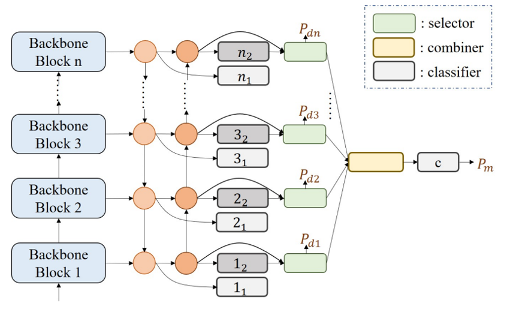
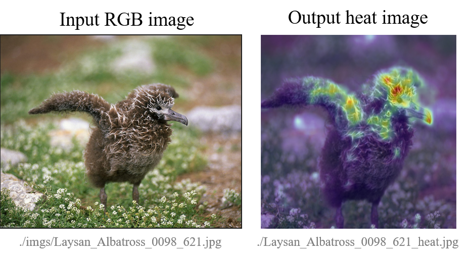
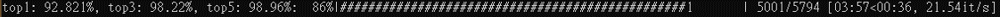
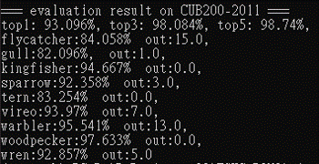

# Fine-grained Visual Classification with High-temperature Refinement and Background Suppression

[](https://paperswithcode.com/sota/fine-grained-image-classification-on-cub-200?p=fine-grained-visual-classification-with-high-1)

[](https://paperswithcode.com/sota/fine-grained-image-classification-on-nabirds?p=fine-grained-visual-classification-with-high-1)

paper url: https://arxiv.org/abs/2303.06442 

The high-temperature refinement module allows the model to learn the appropriate feature scales by refining the features map at different scales and improving the learning of diverse features. And, the background suppression module first splits the features map into foreground and background using classification confidence scores and suppresses feature values in low-confidence areas while enhancing discriminative features. The experimental results show that the proposed HERBS effectively fuses features of varying scales, suppresses background noise, discriminative features at appropriate scales for fine-grained visual classification.The proposed method achieves state-of-the-art performance on the CUB-200-2011 and NABirds benchmarks, surpassing 93% accuracy on both datasets. Thus, HERBS presents a promising solution for improving the performance of fine-grained visual classification tasks.



!!!!!!!!!!!!!!!!!!!!!!!!!!!!!!!!!!!!!!!!!!!!!!!!!!!!!!!!!!!!!!!!!!!!!!!!!!!!!!!!!!!!!!!
# Please note that currently, only the **Swin Transformer backbone** is supported.
!!!!!!!!!!!!!!!!!!!!!!!!!!!!!!!!!!!!!!!!!!!!!!!!!!!!!!!!!!!!!!!!!!!!!!!!!!!!!!!!!!!!!!!

## 1. Environment setting 

// We move old version to ./v0/

### 1.0. Package
* install requirements
* replace folder timm/ to our timm/ folder (for ViT or Swin-T)  
    
    #### pytorch model implementation [timm](https://github.com/rwightman/pytorch-image-models)
    #### recommand [anaconda](https://www.anaconda.com/products/distribution)
    #### recommand [weights and biases](https://wandb.ai/site)
    #### [deepspeed](https://www.deepspeed.ai/getting-started/) // future works

### 1.1. Dataset
In this paper, we use 2 large bird's datasets to evaluate performance:
* [CUB-200-2011](http://www.vision.caltech.edu/visipedia/CUB-200-2011.html)
* [NA-Birds](https://dl.allaboutbirds.org/nabirds)

### 1.2. Our pretrained model

* our pretrained model in 
* cub200: https://idocntnu-my.sharepoint.com/:f:/g/personal/81075001h_eduad_ntnu_edu_tw/EiXAfUuY3OJCjsF2cFeeEZoBKKKUDPLczUcJsAiRCjW1gg?e=LffbXM

### 1.3. OS
- [x] Windows10
- [x] Ubuntu20.04
- [x] macOS (CPU only)

## 2. Train
- [x] Single GPU Training
- [ ] DataParallel (single machine multi-gpus)
- [ ] DistributedDataParallel

(more information: https://pytorch.org/tutorials/intermediate/ddp_tutorial.html)

### 2.1. data
train data and test data structure:  
```
├── tain/
│   ├── class1/
│   |   ├── img001.jpg
│   |   ├── img002.jpg
│   |   └── ....
│   ├── class2/
│   |   ├── img001.jpg
│   |   ├── img002.jpg
│   |   └── ....
│   └── ....
└──
```

### 2.2. configuration
you can directly modify yaml file (in ./configs/)

### 2.3. run
```
python main.py --c ./configs/config.yaml
```
model will save in ./records/{project_name}/{exp_name}/backup/


## 3. HeatMap
```
python vis_swin_l.py -pr ./backups/CUB200-2011/best.pt --image ./imgs/Laysan_Albatross_0098_621.jpg --save_name Laysan_Albatross_0098_621_heat
```



## 4. Evaluation
for CUB200-2011.
```
python run_evaluation.py -pr ./backups/CUB200-2011/ -ir ./datas/test/
```

-pr: pretrained root
```
├── pretrained_root/
│   |   ├── config.yaml
│   |   └── best.pt
```

-ir: images root

```
├── images_root/
│   |   ├── img001.jpg
│   |   ├── img002.jpg
│   |   └── ....
```

### 4.1 running


### 4.2 result
The results will show the fine-class accuracy and the number of outer errors. Outer errors refer to cases where the model predicts the wrong class and this class is not within the fine-class.



# Future update
- ResNet, Efficient support
- Small model
- Medical image support
